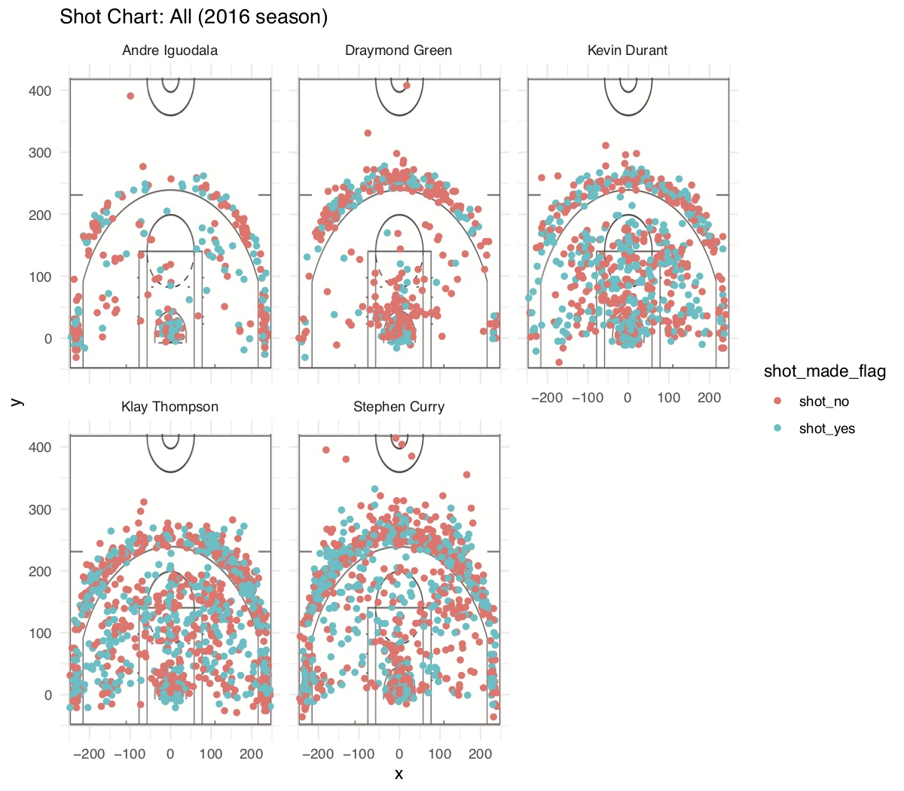

```{r setup, include=FALSE}
knitr::opts_chunk$set(echo = TRUE)
```

## 5.1) Effective Shooting Percentage

```{r shots}
total <- read.csv("../data/shots-data.csv")
iggy <- read.csv("../data/andre-iguodala.csv")
steph <- read.csv("../data/stephen-curry.csv")
dray <- read.csv("../data/draymond-green.csv")
kev <- read.csv("../data/kevin-durant.csv")
klay <- read.csv("../data/klay-thompson.csv")
table1 <- iggy[iggy$shot_type == "2PT Field Goal",]
y <- table1[table1$shot_made_flag == 'y',]
iggydata2 <- c('Andre Iguodala', nrow(table1), nrow(y), nrow(y)/ nrow(table1) * 100)
table2 <- dray[dray$shot_type == "2PT Field Goal",]
x <- table2[table2$shot_made_flag == 'y',]
draydata2 <- c('Draymond Green', nrow(table2), nrow(x), nrow(x)/ nrow(table2) * 100)
table3 <- kev[kev$shot_type == "2PT Field Goal",]
z <- table3[table3$shot_made_flag == 'y',]
kevdata2 <- c('Kevin Durant', nrow(table3), nrow(z), nrow(z)/ nrow(table3) * 100)
table4 <- klay[klay$shot_type == "2PT Field Goal",]
a <- table4[table4$shot_made_flag == 'y',]
klaydata2 <- c('Klay Thompson', nrow(table4), nrow(a), nrow(a)/ nrow(table4) * 100)
table5 <- steph[steph$shot_type == "2PT Field Goal",]
b <- table5[table5$shot_made_flag == 'y',]
stephdata2 <- c('Stephen Curry', nrow(table5), nrow(b), nrow(b)/ nrow(table5) * 100)
esp2 <- rbind(iggydata2, draydata2, kevdata2, klaydata2, stephdata2)
esp2
table6 <- steph[steph$shot_type == "3PT Field Goal",]
c <- table5[table5$shot_made_flag == 'y',]
stephdata3 <- c('Stephen Curry', nrow(table6), nrow(c), nrow(c)/ nrow(table6) * 100)
table7 <- klay[klay$shot_type == "3PT Field Goal",]
d <- table7[table7$shot_made_flag == 'y',]
klaydata3 <- c('Klay Thompson', nrow(table7), nrow(d), nrow(d)/ nrow(table7) * 100)
table8 <- kev[kev$shot_type == "3PT Field Goal",]
e <- table8[table8$shot_made_flag == 'y',]
kevdata3 <- c('Kevin Durant', nrow(table8), nrow(e), nrow(e)/ nrow(table8) * 100)
table9 <- dray[dray$shot_type == "3PT Field Goal",]
f <- table9[table9$shot_made_flag == 'y',]
draydata3 <- c('Draymond Green', nrow(table9), nrow(f), nrow(f)/ nrow(table9) * 100)
table10 <- iggy[iggy$shot_type == "3PT Field Goal",]
g <- table10[table10$shot_made_flag == 'y',]
iggydata3 <- c('Andre Iguodala', nrow(table10), nrow(g), nrow(g)/ nrow(table10) * 100)
esp3 <- rbind(iggydata3, draydata3, kevdata3, klaydata3, stephdata3)
esp3
iggydatasum <- c('Andre Iguodala', nrow(iggy), 58 + 134,  (58 + 134) / nrow(iggy) * 100)
draydatasum <- c('Draymond Green', nrow(dray), 171 + 74,  (171 + 74) / nrow(dray) * 100)
kevdatasum <- c('Kevin Durant', nrow(kev), 390 + 105,  (390 + 105) / nrow(kev) * 100)
klaydatasum <- c('Klay Thompson', nrow(klay), 329 + 246,  (329 + 246) / nrow(klay) * 100)
stephdatasum <- c('Stephen Curry', nrow(steph), 304 + 304,  (304 + 304) / nrow(steph) * 100)
espsum <- rbind(iggydatasum, draydatasum, kevdatasum, klaydatasum, stephdatasum)
espsum
```

## 5.2) Narrative

### Motivation 

The first movie I remember watching, at the age of 3, is Space Jam - a movie starring Michael Jordan and the Looney Tunes. Ever since then, I fell in love with the game. Playing on both junior varsity and varsity teams, I’ve always regarded basketball as an integral component in my life. The 96’ Chicago Bulls, Jordan’s team, set the record for most wins in a Regular Season with 72 wins. This record was thought to be insurmountable; however, Stephen Curry and the Golden State Warriors weren’t phased by the challenge at all - The Warriors set the new record for most wins with 73 wins! I believed that analyzing their shot charts would help me understand what made the Warriors so successful. Furthermore, I believed that visualizing where these players would shoot from would help me improve my game by identifying potential areas of defensive weakness and higher probability to score.   

### Background

The Golden State Warriors have revolutionized basketball. Their story of triumph over speculation is no small feat - it took hard work and creativity to do what they did. Now, every position must have a better 3 Point Field Goal percentage thanks to them. Stephen Curry, a man who was said to be one of the worst first round picks of all time, is now an award winner for Most Valuable Player (MVP) and the Warriors, currently, have one of the strongest lineups ever witnessed. This report highlights where the Warriors have come to today, after years of hardship and doubt over whether this team would ever succeed in winning a championship again.

The Golden State Warriors are currently notoriously known for their acquisition of Kevin Durant - an MVP calibre player who could easily carry his own franchise chose to join this already strong team. Notwithstanding this, how has Kevin Durant performed for this team? Is he lazy and dependent on the Splash Brothers (Steph and Klay), or is he going to cast a shadow on them as they Bay Area’s new leader? After acquiring Kevin Durant, have the original starting have lowered their shooting percentages or stats to accomodate for Kevin Durant’s playing time? This data will help analyze these questions as well. 


### Data 

Here is the presented data for each player: 
```{r data}
esp2
esp3
espsum
```
esp2 represents the Effective Shooting Percentage for 2 Point Field Goals for each player; esp3 represents the Effective Shooting Percentage for 3 Point Field Goals for each player; espsum represents the Effective Shooting Percentage for all types of Field Goals for each player. Each table consists of 4 columns:

  1. name  - the name of the player. 
  2. total - the total number of shots taken by each player.
  3. made - the number of shots made by each player. 
  4. perc_made - the percentage of total shots made by each player. 

### Analysis 

 What can be observed from the data is that each player being analyzed has HIGH offensive ratings. In the NBA, a 2 Point Field Goal percentage above 50 percent is related with a high level of skill. Each player has higher than, if not close to a 50 percent 2 Point Field Goal Percentage, with Andre Iguodala at the highest with 63.8% and Draymond Green at the lowest with 49.4%

With respect to the 3 Point Field Goal Percentage, a percentage over 40 percent is considered elite, and a percentage over 35 percent is considered very good. 4 out of the 5 players have a 3 Point Field Goal Percentage above 35 percent, and two of those (Steph and Klay) are above 40 percent. 

When analyzing the visual shot charts (shown in the discussion below), it can be observed that as the number of shots taken increases, the number of mid-range shots (not 3 point field goals and not field goals in the paint, or the rectangle closest to the basket) increases. 

### Discussion 

Here is the shot chart for each player, with each dot representing the coordinates (x, y) where the shot was taken. The dot is either red or green, with red representing missed shots and green representing made shots. 



From the visuals above, it is clear that Stephen Curry, Klay Thompson, and Kevin Durant have taken the most number of shots. Between these players, looking at the espmsum table for each, the perc-made column states that Kevin Durant has the highest Field Goal Percentage out of the 3 players. But does this mean that he’s the best player on the team? No. This is because, when analyzing the espsum table, it can be viewed that both Steph and Klay have taken  335 and 305 respectively more shots than Kevin Durant. Therefore, it is not evident whether or not Kevin Durant is the best player on the Golden State Warriors. 

However, when analyzing the esp2 table, it can observed that Andre Iguodala is, in fact, the best inside with a 63.8 % 2 Point Field Goal Percentage. This means that even though Andre Iguodala gets less minutes, made evident due to the fact that he had only shot the ball 371 times in 2016 (the least out of all players in the table), he scored more often than he missed, indicating a high impact on the court. 
 
 
In the Analysis section, an observation was made stating that “as the number of shots taken increases, the number of mid-range shots (not 3 point field goals and not field goals in the paint, or the rectangle closest to the basket) increases.” From this, the point that can be made is that players prefer taking 3 Point Field Goals and layups over mid-range shots. This is because, looking at Andre Iguodala’s shot chart relative to Stephen Curry’s shot chart, a large concentration of shots taken lie outside the 3 point range, and close to layup range, while Steph’s are all over the place. This means that Andre Iguodala, a player with a high 2 Point Field Goal Percentage, prefers taking layups and 3 point shots as they would be the least contested in certain environments. 

### Conclusions

The original question was “After acquiring Kevin Durant, have the original starting have lowered their shooting percentages or stats to accomodate for Kevin Durant’s playing time?” After visualizing and analyzing the data, it can be concluded that Kevin Durant **does**, in fact, make an impact on the court; however, he has not replaced Stephen Curry and Klay Thompson as the best shooter on the team.

What can also be concluded from this is that the Warriors are a force to be reckoned with. Each player analyzed above has very respectable offensive statistics that would ensure high scoring games. Those, such as Draymond Green, who do not contribute much to the scoring aspect of the game, tend to perform much better defensively, allowing for leads to be retained and further built upon through the scoring forces in Durant, Thompson, and Curry. They are most likely to win the NBA Championship for the foreseeable future, and with the drive and motivation to rebuke doubters, I’m not sure what they’ll manage to achieve next.  

### References 

All data used is from the tables provided by the class and any information mentioned above is based off anecdotes and estimates made through experience playing the sport. 


  

